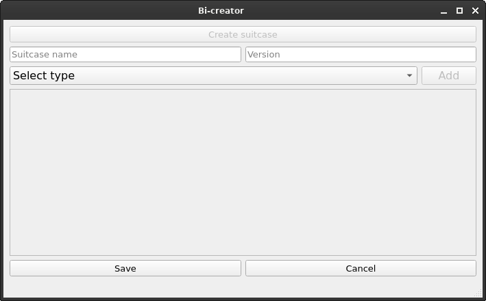
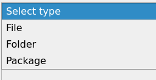

# Bi-creator

*Simple tool for creating complex bi-packages*

### What is it?

Bi-creator is a tool for creating bi-packages - extensions for project called [Breath OS](https://breathos.github.io/). Find software that you use on a daily basis and configurations for it, then build a bi-package using this tool and share it with others!

### How can it be helpful?

Having some package that contains everything that you usually use on your device, for example, for work can be very handy, when it is required to setup a fresh computer. So, do it now and create a package with everything that you need in a one pack use deploy on every machine, or even in cloud! Do not forget, to share you package with others: may be someone will find it helpful, too and thank you for it. 

### What is supported?

**Package(Program)** - a piece of software, that you want to add to your package. For now only Ubuntu packages are supported.

**File** - it can be some config file, property file, or even a wallpaper for desktop that you want to have in this package. 

**Folder** - maybe you need a whole folder of file, it is up to you, but it is also possible to add to your package.

### I am ready! How to start?
Firstly, press *Create suitcase* button. Then, you can specify name and version of a new suitcase.
You can add and remove components (packages, files) of that suitcase using corresponding buttons.

More documentation for each type:
- 
- 
- 

Finally, press *Save* button and wait for process completion. 
You can share ready bi-file with others!

