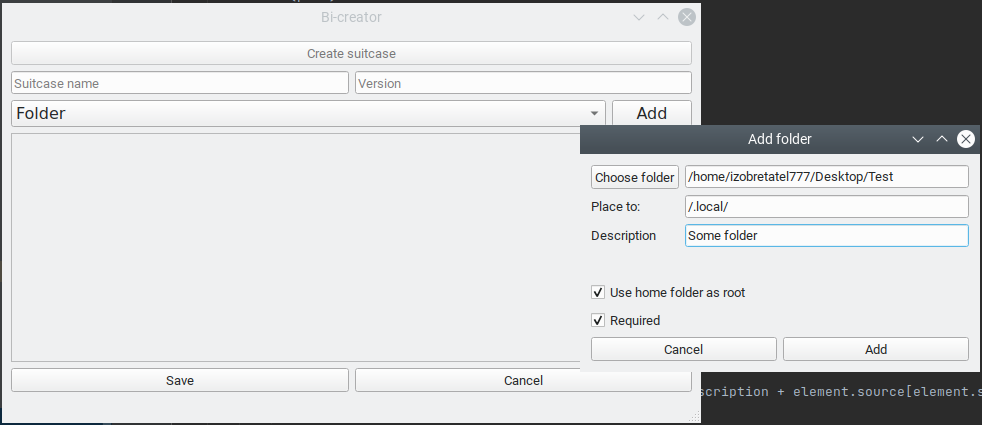

# Adding folders

There are three main fields that you have:
- **Target folder path (source)** - folder that should be added to suitcase.
You can choose it in menu after pressing **Choice folder** button. 
- **Destination** - directory to which folder should be put during a suitcase installation process.
- **Description** - simple description why this folder need. Normally, it should be very short.

Additionally, there are two checkboxes;
- **Use home folder as root** - if you need to place the folder somewhere in user's home directory tick this box.
During installation, it will use home directory of the active user (like `~` sign).
- **Required** - is this folder should be in the system. In the future, this option will be deprecated.

At the end, press **Add** button. Folder will be added to the suitcase during creation process.
