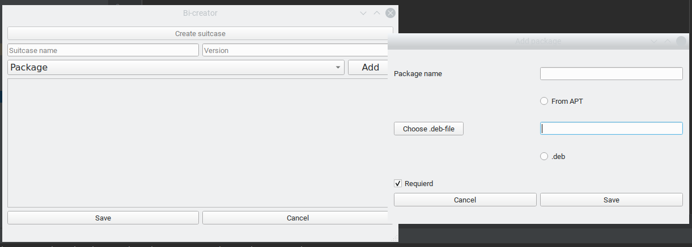
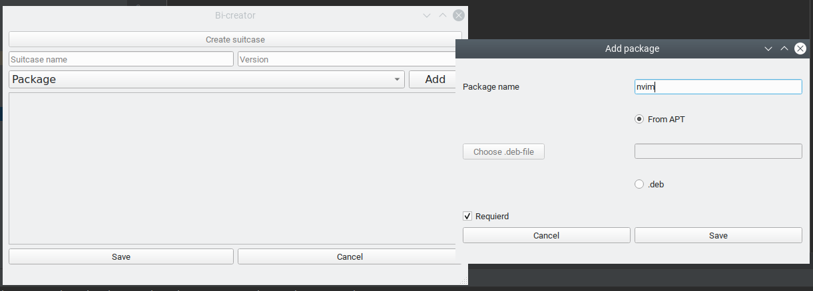
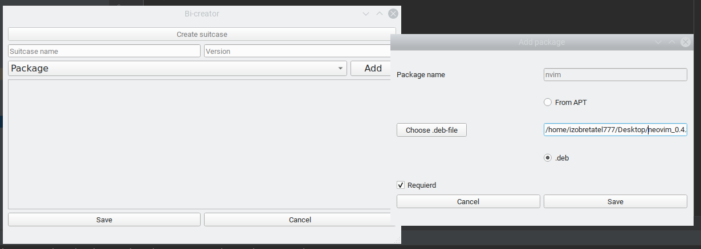
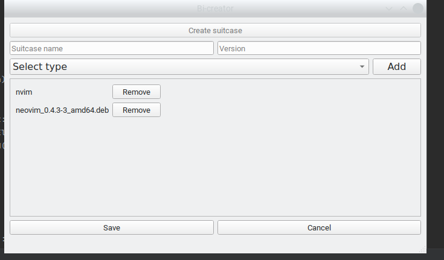

# Adding packages

For now, only packages compatible with APT.

## Adding package

You have two choices:
- Use packages that already available in repository of the system
- Install a new .deb package

Switch using special radio button. You can mix both ways and install several packages.
But be sure that they will not conflict with one another or the target system packages.

## Installation through APT

Just type the name of package that should be downloaded and installed using APT package manager.
It will be downloaded with all corresponding dependencies.
You can also specify version of packages using standard APT syntax: `package=version`.

## Installation of a single .deb file.

You can also add a single .deb file by specifying the path to it.
During the creation of a suitcase this .deb package will be added.
During the installation on the target system all necessary dependencies will be downloaded.

## End

As usual, you can manipulate with packages like other components.

## Problems
There can be several problems that you can struggle with:
- **Not all dependencies are satisfied** - the package that you want to install have some dependencies
which are not available in the APT repositories of the target system or conflict with other package(s). 
- **Package is not available in APT** - the package that you want to install is not found in repositories.
- **Bad .deb package** - you have .deb package that is not compatible with target system or even corrupted.

For all problems, the simplest thing that you can do is to exclude it or find alternative.
Also, you can try manually add some repos on the target system.